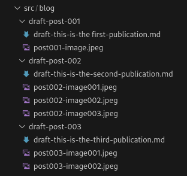

In this article I will explain the worflow I used to publish a post in this site. This will go from creating the draft, reviewing the content, set it ready to publish and finally deploy it to Github pages. The general process is to maintain a branch dedicated to posts and have them there until they are published, this is to merge this posts-drafts branch to the main which will make the post to appear in the live site. 

Each article file will be stored in a folder along with the images or any other resouce to be used in the article.



I decided to use this approach just because is easier to link to images without fighting with relative paths and possible 404 errors, etc.

The front matter in each md file will include the following info:

- title: The title of the publication
- tags: Will be use to set the type of publication. In my case it will be 'posts' or 'pages'
- publictags: Set the different tags to classify each post
- date: Publication date
- draft: Set to 'true' or 'false'. This is used to determine if the post is still in draft state or ready to be published. 

To make things easier I have created a folder with a random name and an empty post to use it as a template. This post only contains the front matter. This way I just need to copy and paste the folder, change the name of the files and set the correct values in the front matter. No need to create anything from scratch.

Initially the 'draft' field will be set to 'true' and the 'date' field will be set to a future day (in my implementation the date will be used to determine if the post will be shown or not in the list of posts). Once all this is done, let's go with the publishing workflow.

As I said in the beginning, I'm using GH Pages to host the site and publish the posts. In general, the publication will consist in creating a branch for every article. Once the article is done, merge this branch to the 'posts' branch and, once the article is reviewed and everything is correct, merge the post branch with the 'main' branch in the GH repository. This will cause the article to go live in the site. This in details below.

To publish a post in GH Pages, I have created a branch called 'posts'. In this branch I will be creating several branches, each for each different article or draft that is on process. 

```


        draft-001 ___... draft002 _____...  
     posts ______/_______________/_____...
main  ____/____________________________...


```

As a convention, I decided to add the prefix 'draft-' to the name of the folder and to the name of the file. This way I can identify if a specific article is a draft just looking at the folder, no need to open the file and check the 'draft' field in the frontmatter.

Once the article is finished in its own branch, the steps I follow are:

1. Rename the directory of the article and remove the prefix 'draft-'
2. Rename the article file and also remove the prefix 'draft-'
3. Update the 'date' field in the front matter
4. Set the 'draft' field to 'false' in the front matter

At this point the article is ready to be published. I will do a Pull Request to the branch 'posts' to review the article and propose some changes if needed. If everything is ok, the article branch will be merged with the 'posts' branch and proceed to remove the article branch both locally and in the corresponding remote.

The last step will be to merge the 'posts' branch with the 'main' branch so the artivle can be published. A Pull Request done to the 'main' branch will have the article published to the site. 

One of the advantages of keeping this 'posts' branch and individual branches for each draft is that I can schedule Pull Requests to be done periodically (i.e. each Friday). Everything in the 'posts' branch will be published after the merge is done.